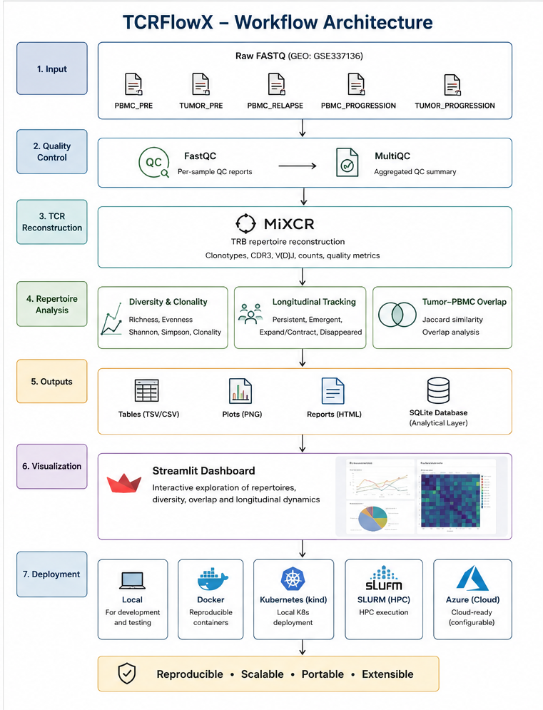

# TCRFlowX

**A reproducible TCR-seq cancer immunogenomics workflow for longitudinal T-cell receptor repertoire analysis.**

[](https://github.com/Sriiraam/TCRFlowX/actions/workflows/ci.yml)


[](https://tcrflowx.streamlit.app/)

## Live Demo

Explore TCRFlowX directly in your browser — no local installation required.

**[Launch the TCRFlowX dashboard →](https://tcrflowx.streamlit.app/)**


## Overview

TCRFlowX is an end-to-end bioinformatics workflow for T-cell receptor repertoire analysis from paired-end TCR-seq data.

The project combines:

- Nextflow DSL2 workflow orchestration
- FastQC and MultiQC quality control
- MiXCR TRB repertoire reconstruction
- diversity and clonality analysis
- longitudinal clonotype tracking
- tumor–PBMC repertoire comparison
- author-processed repertoire benchmarking
- computational benchmarking
- SQLite analytical storage
- SQL-based repertoire exploration
- interactive Streamlit visualization
- Docker and local Kubernetes deployment

The workflow was developed using a longitudinal classical Hodgkin lymphoma dataset collected around PD-1 blockade.

---

## Biological Questions

TCRFlowX investigates:

1. How T-cell repertoire diversity and clonality change from pre-treatment to relapse and progression.
2. Which clonotypes persist, emerge, expand, contract, or disappear over time.
3. How similar peripheral blood and tumor repertoires are at matched clinical stages.
4. Whether the reconstructed repertoire agrees with the author-provided processed repertoire.

---

## Dataset

**GEO:** GSE337136  
**Organism:** Homo sapiens  
**Assay:** TCR-seq  
**Platform:** Illumina MiSeq  
**Target:** TRB  
**Protocol:** Invivoscribe LymphoTrack TRB assay  
**Input:** genomic DNA

| Sample | Tissue | Clinical stage |
|---|---|---|
| PBMC_PRE | PBMC | Pre-treatment |
| TUMOR_PRE | Tumor | Pre-treatment |
| PBMC_RELAPSE | PBMC | Relapse |
| PBMC_PROGRESSION | PBMC | Progressive disease |
| TUMOR_PROGRESSION | Tumor | Progressive disease |

---

## Workflow Architecture




TCRFlowX uses Nextflow DSL2 to orchestrate the complete analytical workflow.

```text
Paired-end FASTQ
      |
      v
   FastQC
      |
      v
   MultiQC
      |
      v
    MiXCR
      |
      v
TRB clonotype tables
      |
      +-------------------------------+
      |                               |
      v                               v
Diversity / Clonality        Longitudinal clone tracking
      |                               |
      +---------------+---------------+
                      |
                      v
             Tumor–PBMC overlap
                      |
                      v
             Biological summary
                      |
          +-----------+-----------+
          |                       |
          v                       v
      Benchmarking          SQLite database
                                  |
                                  v
                           SQL exploration
                                  |
                                  v
                         Streamlit dashboard
```

Nextflow DSL2 orchestrates the complete analytical workflow.

---

## Repository Structure

```text
TCRFlowX/
├── main.nf
├── nextflow.config
├── conf/
│   ├── local.config
│   ├── docker.config
│   ├── slurm.config
│   ├── k8s.config
│   └── azure.config
├── modules/
│   ├── fastqc.nf
│   ├── multiqc.nf
│   ├── mixcr.nf
│   ├── repertoire_analysis.nf
│   └── biological_summary.nf
├── workflow/
│   └── subworkflows/
│       ├── qc.nf
│       └── repertoire.nf
├── scripts/
├── database/
├── streamlit_app/
├── tests/
├── docs/
├── results/
├── Dockerfile
├── requirements.txt
├── requirements-dashboard.txt
├── CHANGELOG.md
├── CITATION.cff
├── CONTRIBUTING.md
├── SECURITY.md
└── LICENSE
```

Generated workflow outputs, raw sequencing data, work directories, and local databases are excluded from version control.

---

## Requirements

Core tools used during development:

- Nextflow 25.10+
- Java 17
- Python 3.12
- R 4.3+
- MiXCR 4.7
- FastQC
- MultiQC
- Docker
- SQLite
- Streamlit

---

## Quick Start

Clone the repository:

```bash
git clone https://github.com/Sriiraam/TCRFlowX.git
cd TCRFlowX
```

Create a Python environment:

```bash
python3 -m venv .venv
source .venv/bin/activate
pip install -r requirements.txt
```

Place paired-end FASTQ files in:

```text
data/raw/fastq/
```

Run locally:

```bash
nextflow run main.nf -profile local
```

Resume an interrupted or previously executed workflow:

```bash
nextflow run main.nf -profile local -resume
```

---

## Execution Profiles

| Profile | Purpose | Status |
|---|---|---|
| `local` | Local workstation execution | Validated |
| `docker` | Docker-enabled execution profile | Configuration validated |
| `slurm` | HPC execution using SLURM | Template provided; cluster-specific configuration required |
| `k8s` | Kubernetes execution profile | Configuration validated |
| `azure` | Azure execution scaffold | Requires explicit cloud configuration |

Cloud credentials and paid resources are never automatically provisioned by this repository.

---

## Nextflow Design

TCRFlowX uses modular DSL2 components.

### QC subworkflow

```text
QC_WORKFLOW
├── FASTQC
└── MULTIQC
```

### Repertoire subworkflow

```text
REPERTOIRE_WORKFLOW
├── MIXCR
├── REPERTOIRE_ANALYSIS
└── BIOLOGICAL_SUMMARY
```

Individual computational processes remain isolated under `modules/`.

---

## MiXCR Reconstruction

TRB reconstruction uses the protocol-specific preset:

```text
invivoscribe-human-dna-trb-lymphotrack
```

Example reconstructed productive clonotype counts:

| Sample | Productive clonotypes |
|---|---:|
| PBMC_PRE | 4,835 |
| TUMOR_PRE | 4,546 |
| PBMC_RELAPSE | 1,862 |
| PBMC_PROGRESSION | 5,018 |
| TUMOR_PROGRESSION | 2,467 |

---

## Repertoire Results

### PBMC longitudinal dynamics

| Stage | Richness | Shannon | Clonality |
|---|---:|---:|---:|
| Pre-treatment | 4,994 | 7.33 | 0.139 |
| Relapse | 1,862 | 5.65 | 0.250 |
| Progression | 5,193 | 6.68 | 0.219 |

The PBMC repertoire contracts strongly at relapse, followed by recovery in richness during progression while remaining more clonal than the pre-treatment repertoire.

### Tumor–PBMC overlap

| Stage | Shared clonotypes | Jaccard |
|---|---:|---:|
| Pre-treatment | 1,096 | 0.132 |
| Progression | 445 | 0.063 |

Blood–tumor repertoire similarity decreases substantially by progression.

### Longitudinal clone classes

- Persistent PBMC clonotypes: **206**
- Relapse-emergent clonotypes: **1,468**
- Progression-emergent clonotypes: **4,205**

---

## Technical Validation

The reconstructed pre-treatment PBMC repertoire was benchmarked against the author-provided processed repertoire.

| Metric | Result |
|---|---:|
| Shared productive CDR3 sequences | 4,795 |
| Jaccard similarity | 0.983 |
| Top-20 agreement | 20 / 20 |
| Top-100 agreement | 98 / 100 |
| Spearman correlation | 0.997 |

This demonstrates strong agreement between the TCRFlowX reconstruction and the published processed repertoire.

---

## Pipeline Benchmarking

Nextflow execution metrics are collected using:

- trace
- report
- timeline
- DAG

MiXCR is the most computationally intensive stage, using approximately 2.6–2.8 GB resident memory during this dataset run.

Benchmark summaries are generated under:

```text
results/benchmark/
```

---

## SQLite Analytical Layer

Processed repertoire outputs are loaded into:

```text
database/tcrflowx.db
```

Major tables include:

```text
samples
clonotypes
diversity_metrics
mixcr_qc
tumor_pbmc_overlap
pairwise_jaccard
pbmc_longitudinal
```

The database currently contains more than **24,000 clonotype records**.

Example:

```sql
SELECT
    sample_id,
    cdr3_aa,
    read_count,
    read_fraction
FROM clonotypes
ORDER BY read_fraction DESC
LIMIT 10;
```

Reusable analytical queries are available in:

```text
database/analysis_queries.sql
```

---

## Interactive Dashboard

Launch the Streamlit application:

```bash
streamlit run streamlit_app/app.py
```

The dashboard provides interactive exploration of:

- sequencing quality
- MiXCR reconstruction metrics
- repertoire diversity
- clonotype dominance
- longitudinal clone dynamics
- tumor–PBMC similarity
- biological interpretation
- SQL-driven repertoire analysis

---

## Docker Dashboard

Build:

```bash
docker build -t tcrflowx-dashboard .
```

Run:

```bash
docker run --rm \
  -p 8501:8501 \
  -v "$PWD/results:/opt/tcrflowx/results:ro" \
  -v "$PWD/database:/opt/tcrflowx/database:ro" \
  tcrflowx-dashboard
```

Open:

```text
http://localhost:8501
```

---

## Kubernetes

The dashboard was validated locally using a `kind` Kubernetes cluster.

Example deployment:

```bash
kind create cluster --name tcrflowx

kind load docker-image tcrflowx-dashboard:latest \
  --name tcrflowx

kubectl apply -f k8s-dashboard.yaml

kubectl port-forward \
  service/tcrflowx-dashboard \
  8501:8501
```

This Kubernetes deployment is intended for local portfolio validation and development.

---

## Testing

Run the complete test suite:

```bash
pytest -v tests/
```

Current validation:

```text
9 tests passed
```

Tests verify:

- expected workflow outputs
- repertoire metrics
- SQLite database integrity
- expected sample identities
- benchmark outputs
- required repository files
- Nextflow modules
- subworkflows
- execution profile configuration

---

## Continuous Integration

GitHub Actions validates:

- Python tests
- repository structure
- Nextflow execution profile configuration
- Docker dashboard image build

Workflow:

```text
.github/workflows/ci.yml
```

CI runs automatically on pushes and pull requests to `main`.

---

## Reproducibility

TCRFlowX emphasizes:

- modular Nextflow DSL2 processes
- reproducible workflow execution
- resumable computation
- explicit configuration profiles
- version-controlled analytical code
- containerized dashboard deployment
- automated testing
- technical benchmarking
- documented provenance
- database-backed result exploration

---

## Limitations

This project analyzes a single-patient longitudinal dataset.

The biological results should therefore be treated as descriptive and hypothesis-generating rather than population-level clinical conclusions.

TCRFlowX is intended for research, education, workflow engineering, and portfolio demonstration.

---

## Security and Research Data

Credentials, access tokens, software license keys, and patient-identifiable information must never be committed to the repository.

See:

```text
SECURITY.md
```

---

## Contributing

Contributions, bug reports, and suggestions are welcome.

See:

```text
CONTRIBUTING.md
```

---

## Citation

If you use TCRFlowX, citation metadata is available in:

```text
CITATION.cff
```

---

## Changelog

Project changes and release history are documented in:

```text
CHANGELOG.md
```

---

## License

TCRFlowX is released under the MIT License.

See:

```text
LICENSE
```

---

## Author

**Sriram B**

GitHub: [Sriiraam](https://github.com/Sriiraam)

---

## Disclaimer

TCRFlowX is a research bioinformatics workflow and is not intended for clinical diagnosis or medical decision-making.

---

## Future Upgrades

TCRFlowX v0.1.0 establishes the core reproducible cancer immunogenomics workflow. Future development may include:

- Full end-to-end pipeline containerization
- Real-world SLURM/HPC execution validation
- Azure Batch/cloud execution validation
- Multi-patient and larger-cohort TCR-seq analysis
- Small fixture datasets for automated integration testing
- Expanded unit and workflow-level test coverage
- Additional repertoire similarity and clone-tracking methods
- Automated database generation as part of the Nextflow workflow
- Public dashboard deployment
- GitHub Releases and archival DOI integration

See `CHANGELOG.md` for version history.
